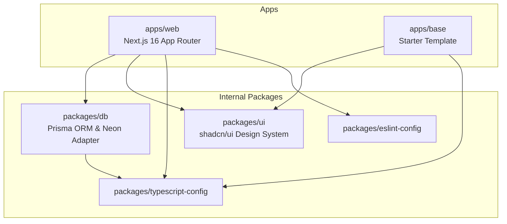
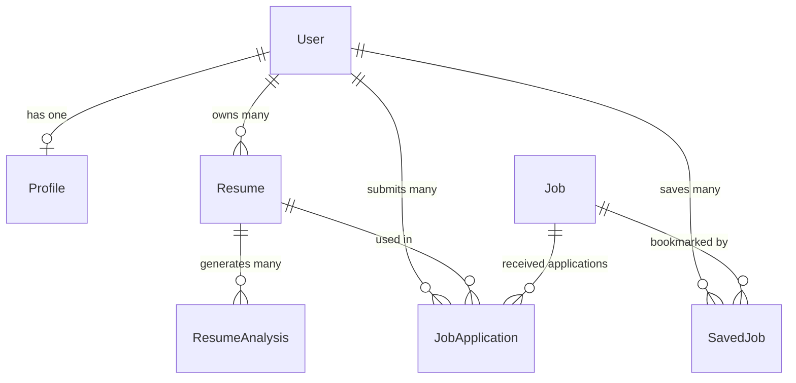
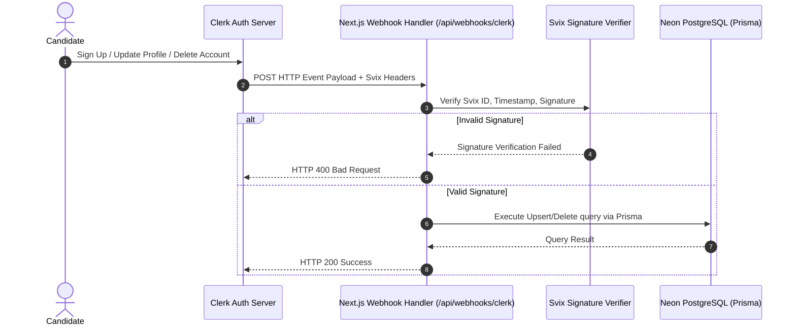
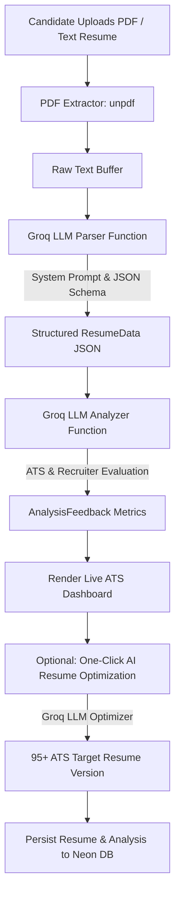

# 📐 Oasian — Technical Architecture & Engineering Deep-Dive

This document details the architectural decisions, system design patterns, data flow mechanisms, and component interactions within the **Oasian** monorepo workspace.

---

## 1. Monorepo Architecture Overview

Oasian is built as a high-performance Turborepo monorepo powered by `pnpm` workspace package management. The monorepo separates concerns cleanly into **Applications (`apps/`)** and **Internal Packages (`packages/`)**:



### Workspace Package Responsibilities

1. **`apps/web`**: Full-stack Next.js 16 application containing client-side React 19 pages, Server Components, API routes (`/api/resume/*`, `/api/webhooks/clerk`), and state management.
2. **`packages/db`**: Encapsulates data persistence. Exports a singleton `PrismaClient` configured with `@neondatabase/serverless` WebSocket adapters. Contains migration scripts, seed data, and schema definitions.
3. **`packages/ui`**: Shared UI component package configured with Tailwind CSS v4 and `lucide-react`. Exports reusable atomic UI components (`Button`, `Card`, `Badge`, `Input`, `Dialog`, etc.).
4. **`packages/typescript-config` & `packages/eslint-config`**: Standardized tsconfig rules (`nextjs.json`, `react-library.json`, `base.json`) and linting configurations for code consistency across packages.

---

## 2. Database Schema & Data Modeling

The database layer utilizes **Neon PostgreSQL** via **Prisma ORM**. Key models include:

### Domain Model Summary



### Key Models & Technical Rationale

- **`User`**: Core user record storing Clerk ID (`clerkId`), email, name, and timestamps. Linked with 1-to-1 Profile and 1-to-Many Resumes and Applications.
- **`Profile`**: Contains structured candidate information (title, location, contact, experience JSON, education JSON) that can be synced with active resumes.
- **`Resume`**: Represents versioned resume instances (`versionNumber`, `versionName`). Stores header details, skill arrays, and structured JSON arrays for experience bullets, education, and projects.
- **`ResumeAnalysis`**: Stores AI-generated evaluation metrics (`overallScore`, `atsScore`, `impactScore`, `brevityScore`, `skillsScore`), summary statements, missing sections, and actionable "Before & After" bullet rewrites.
- **`Job`**: Represents job postings in the system with filterable fields (`category`, `workplaceType`, `jobType`, `salary`, `featured`, `tags`).
- **`JobApplication`**: Tracks candidate job applications with status lifecycle (`applied` → `reviewing` → `interview` → `offer` / `rejected`).

---

## 3. Clerk Webhook User Synchronization Pipeline

To ensure seamless authentication without database desynchronization, Oasian implements a real-time Webhook listener via `Svix`:



### Technical Resilience Highlights:
- **Signature Verification**: Verifies `svix-id`, `svix-timestamp`, and `svix-signature` headers against `CLERK_WEBHOOK_SECRET`.
- **Idempotent Synchronization**: `user.created` and `user.updated` invoke `upsert` queries on `User` and `Profile` tables, preventing duplicate record creation.
- **Cascading Cleanup**: Deleting a user in Clerk triggers a cascading database delete across associated profiles, resumes, and saved job records.

---

## 4. Groq LLM Resume Parsing & Scoring Pipeline

The AI engine leverages Groq's high-speed inference SDK (`groq-sdk`) running the `openai/gpt-oss-120b` (or configurable) LLM model:



### Groq Prompt Engineering & Constraints
1. **JSON Mode Output**: Calls use `response_format: { type: "json_object" }` to guarantee strictly typed JSON payloads.
2. **Deterministic Extraction**: Set `temperature: 0.1` for extraction to minimize hallucinations while normalizing contact info, dates, and experience bullets.
3. **Actionable Rewrites**: Generates concrete `before` vs. `after` bullet comparisons using the **XYZ accomplishment formula** (*Accomplished [X] as measured by [Y] by doing [Z]*).

---

## 5. Database Connection Strategy (Neon Serverless)

In serverless runtime environments (such as Next.js API Routes and Vercel edge/lambda functions), traditional PostgreSQL connection pools can become exhausted. 

Oasian solves this by implementing **Neon's Serverless WebSocket Adapter**:

```typescript
// packages/db/src/client.ts
import { PrismaClient } from "@prisma/client"
import { neonConfig } from "@neondatabase/serverless"
import { PrismaNeon } from "@prisma/adapter-neon"
import ws from "ws"

if (typeof window === "undefined") {
  neonConfig.webSocketConstructor = ws
}

export function createPrismaClient(): PrismaClient {
  const connectionString = process.env.DATABASE_URL

  if (connectionString && process.env.USE_NEON_ADAPTER === "true") {
    const adapter = new PrismaNeon({ connectionString })
    return new PrismaClient({ adapter })
  }

  return new PrismaClient()
}
```

- **WebSocket Connection Pooling**: Allows Next.js API routes to maintain resilient, low-latency database queries across serverless executions.
- **Environment Toggle**: Can switch dynamically between standard PostgreSQL drivers and Neon WebSocket adapters using `USE_NEON_ADAPTER`.
